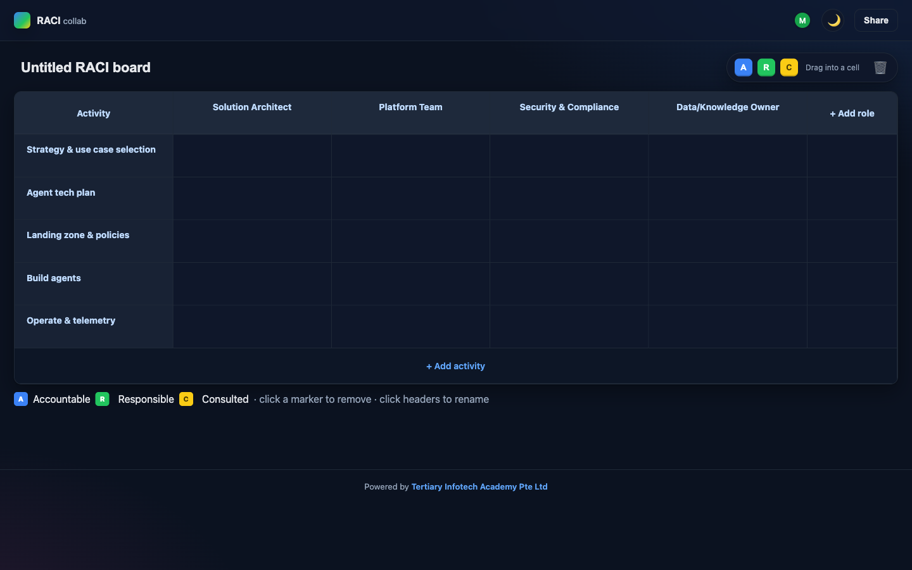

<div align="center">

# RACIcollab

[](https://developer.mozilla.org/docs/Web/HTML)
[](https://developer.mozilla.org/docs/Web/CSS)
[](https://developer.mozilla.org/docs/Web/JavaScript)
[](https://firebase.google.com/)
[](https://alfredang.github.io/raci/)
[](https://opensource.org/licenses/MIT)

**A modern, real-time collaborative RACI matrix tool — drag-and-drop responsibilities, share via QR.**

[Live Demo](https://alfredang.github.io/raci/) · [Report Bug](https://github.com/alfredang/raci/issues) · [Request Feature](https://github.com/alfredang/raci/issues)

</div>

## Screenshot



## About

**RACIcollab** turns the classic RACI chart (Responsible · Accountable · Consulted · Informed) into a live collaborative canvas. Build the matrix together with your team in real time — add roles and activities, drag colored markers into any cell, and share a QR code so anyone can join from their phone. Built as a single-page app with vanilla HTML/CSS/JavaScript and Firebase Realtime Database — no build step, no framework.

### Key features

| Feature | What it does |
|---|---|
| 🟦🟩🟨 **Drag-and-drop markers** | Drag **A** (Accountable), **R** (Responsible), **C** (Consulted) chips into cells. Multiple markers per cell. |
| ⚡ **Real-time sync** | Every edit appears instantly for all collaborators via Firebase RTDB. |
| 📱 **QR-code join** | Share the board with a scannable QR code — no signup needed (anonymous auth). |
| 👥 **Live presence** | See who's currently on the board with colored avatars. |
| 🌓 **Dark / light theme** | Theme toggle persists across sessions. Defaults to dark. |
| ✏️ **Inline editing** | Click any role or activity to rename. Add or delete rows and columns on the fly. |
| 🚀 **Zero build** | Pure ES modules from CDN — open `index.html` and it runs. |

## Tech Stack

| Category | Technology |
|---|---|
| **Frontend** | HTML5, CSS3 (CSS variables, native drag-and-drop), Vanilla JavaScript (ES modules) |
| **Backend** | Firebase Realtime Database (live sync + persistence) |
| **Auth** | Firebase Anonymous Authentication |
| **QR Codes** | [qrcodejs](https://github.com/davidshimjs/qrcodejs) (CDN) |
| **Hosting** | GitHub Pages (deployed via GitHub Actions) |

## Architecture

```
                   ┌──────────────────────────────────────┐
                   │            User's Browser            │
                   │  ┌────────────────────────────────┐  │
                   │  │    index.html (SPA shell)      │  │
                   │  │  ┌──────────┐  ┌────────────┐  │  │
                   │  │  │ Landing  │  │   Board    │  │  │
                   │  │  │  view    │  │   view     │  │  │
                   │  │  └──────────┘  └────────────┘  │  │
                   │  │       │              │         │  │
                   │  │       ▼              ▼         │  │
                   │  │   app.js  board.js  qr.js      │  │
                   │  │              presence.js       │  │
                   │  └──────────────┬─────────────────┘  │
                   └─────────────────┼────────────────────┘
                                     │  Firebase JS SDK v10
                                     ▼
                       ┌─────────────────────────────┐
                       │   Firebase Realtime DB      │
                       │  /boards/{id}/              │
                       │    meta · roles · activities│
                       │    cells · presence         │
                       └─────────────────────────────┘
                                     │
                                     ▼
                       ┌─────────────────────────────┐
                       │  Firebase Anonymous Auth    │
                       └─────────────────────────────┘
```

Each board lives at `/boards/{boardId}` in Firebase Realtime Database. All clients subscribe via `onValue()` and re-render on change. Markers are stored as keyed children of `cells/{activityId}/{roleId}` so multiple markers can coexist in a single cell and each has a unique addressable ID for delete/move.

## Project Structure

```
raci/
├── index.html                       # SPA shell + landing & board templates
├── css/
│   └── styles.css                   # Theme tokens, grid, palette, modal
├── js/
│   ├── app.js                       # Hash router, Firebase init, theme toggle
│   ├── board.js                     # Grid render, drag-and-drop, RTDB sync
│   ├── qr.js                        # Share modal + QR code generation
│   ├── presence.js                  # Online-user avatars
│   ├── firebase-config.js           # Firebase project config
│   └── firebase-config.example.js   # Template for the above
├── .github/
│   └── workflows/
│       └── deploy.yml               # GitHub Pages deploy
├── screenshot.png
├── README.md
└── .gitignore
```

## Getting Started

### Prerequisites

- A modern browser (Chrome, Edge, Firefox, Safari)
- A Firebase project — free tier is plenty
- Python 3 (or any static file server) for local dev

### 1. Clone and configure Firebase

```bash
git clone https://github.com/alfredang/raci.git
cd raci
cp js/firebase-config.example.js js/firebase-config.js
```

Edit `js/firebase-config.js` with your Firebase project values from the Firebase Console → **Project settings → Your apps → Web app config**.

### 2. Set up Firebase

In the Firebase Console:

1. **Authentication → Sign-in method** → enable **Anonymous**.
2. **Build → Realtime Database** → create database.
3. **Realtime Database → Rules** → paste:

   ```json
   {
     "rules": {
       "boards": {
         "$boardId": {
           ".read":  "auth != null",
           ".write": "auth != null"
         }
       }
     }
   }
   ```

   Click **Publish**.

### 3. Run locally

ES modules require a server (`file://` won't work):

```bash
python3 -m http.server 5173
```

Open <http://localhost:5173/>.

### 4. Use it

- Click **Create new board** → you get a unique URL.
- Click **Share** → scan the QR from another device, or copy the link.
- Click any header to rename. Use **+ Add role** / **+ Add activity** to grow the matrix.
- Drag the **A / R / C** swatches from the palette into any cell.
- Click a marker to remove it, or drag it onto the trash can.

## Deployment

This repo deploys to **GitHub Pages** automatically via GitHub Actions — see [`.github/workflows/deploy.yml`](.github/workflows/deploy.yml). Pushes to `main` trigger a deploy to <https://alfredang.github.io/raci/>.

To deploy your own fork:

1. Fork the repo and set up your own Firebase project (steps above).
2. In **Settings → Pages**, set **Source** to **GitHub Actions**.
3. Push to `main`. The workflow will build and publish.

## Contributing

Contributions are welcome.

1. Fork the repo
2. Create a feature branch (`git checkout -b feature/cool-thing`)
3. Commit your changes (`git commit -m "Add cool thing"`)
4. Push to the branch (`git push origin feature/cool-thing`)
5. Open a Pull Request

For larger changes, please open an issue first to discuss the direction.

## Developed By

**Tertiary Infotech Academy Pte Ltd** — <https://www.tertiarycourses.com.sg/>

## Acknowledgements

- [Firebase](https://firebase.google.com/) — realtime database & auth
- [qrcodejs](https://github.com/davidshimjs/qrcodejs) — lightweight QR rendering
- The classic **RACI** matrix — for being a deceptively simple tool that organizations have used for decades to clarify who does what.

---

<div align="center">

If you find this useful, please ⭐ the repo!

</div>
